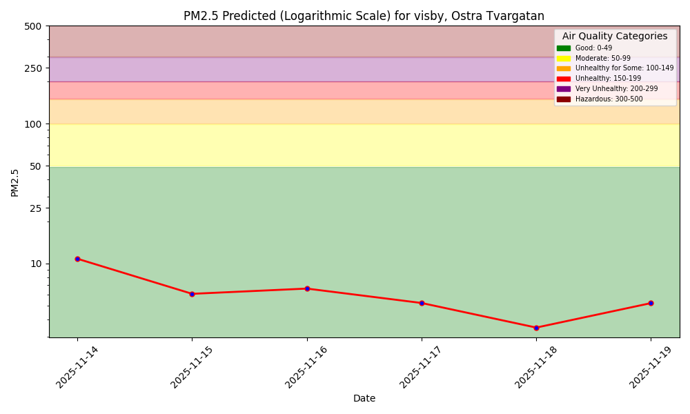
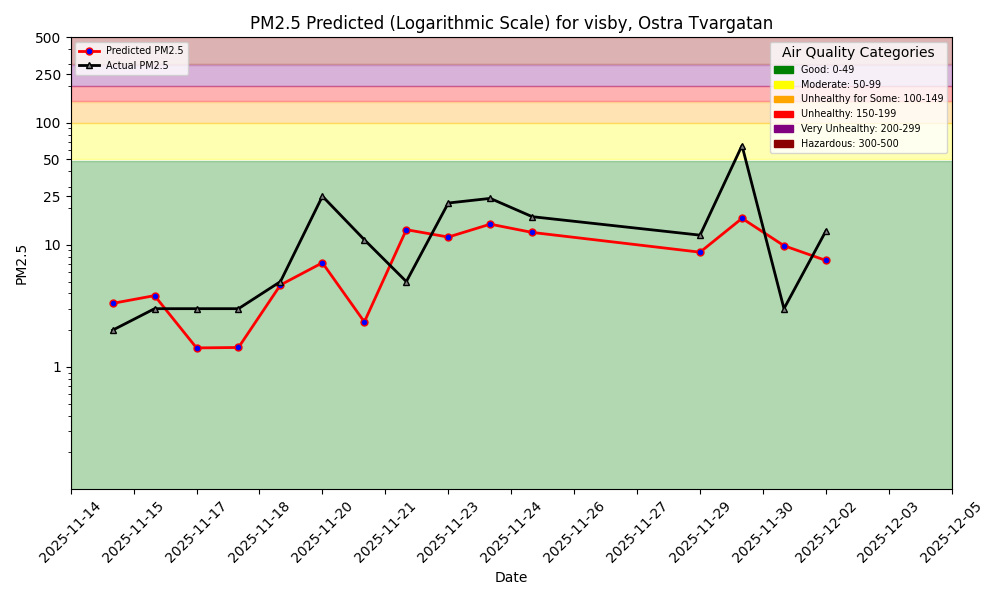
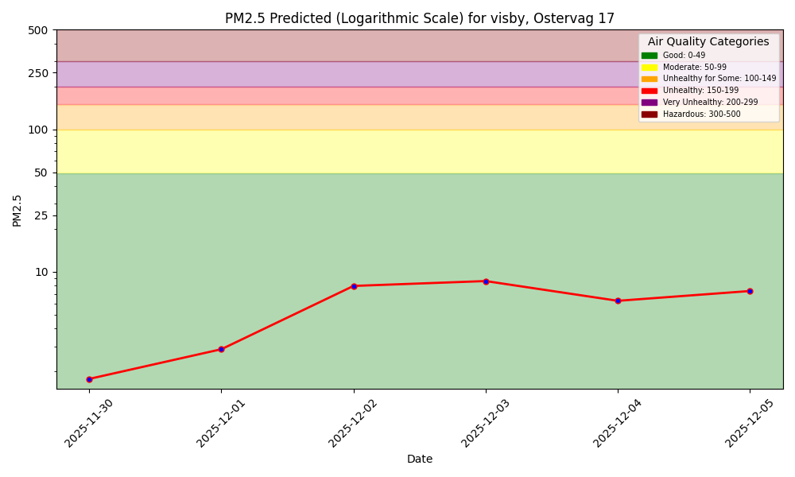
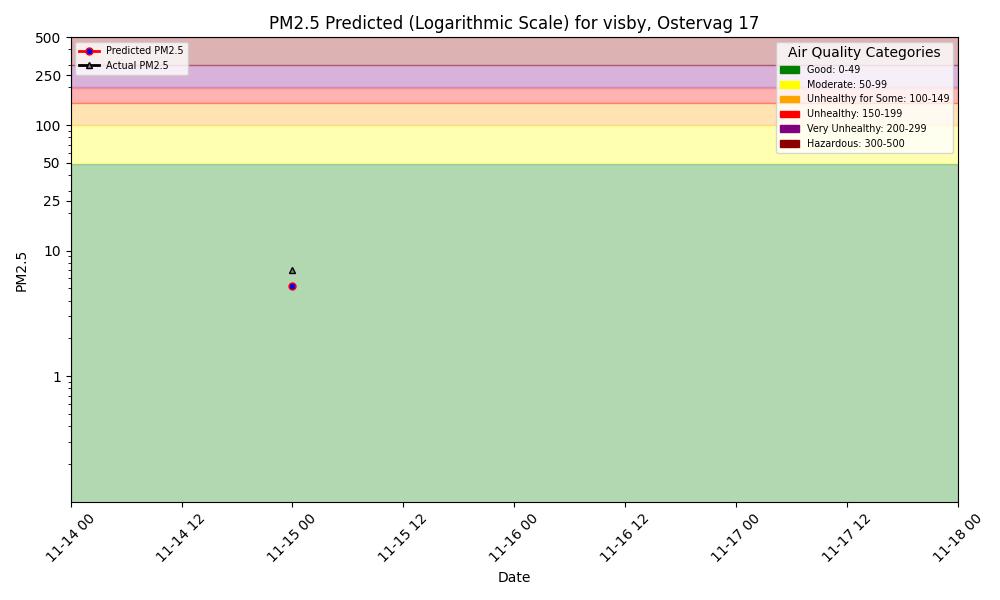
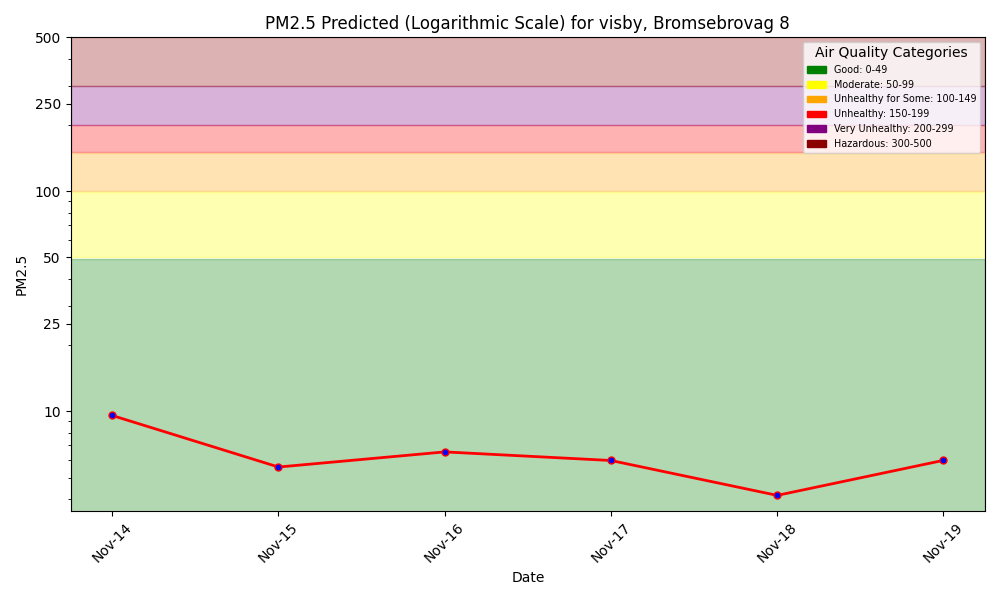
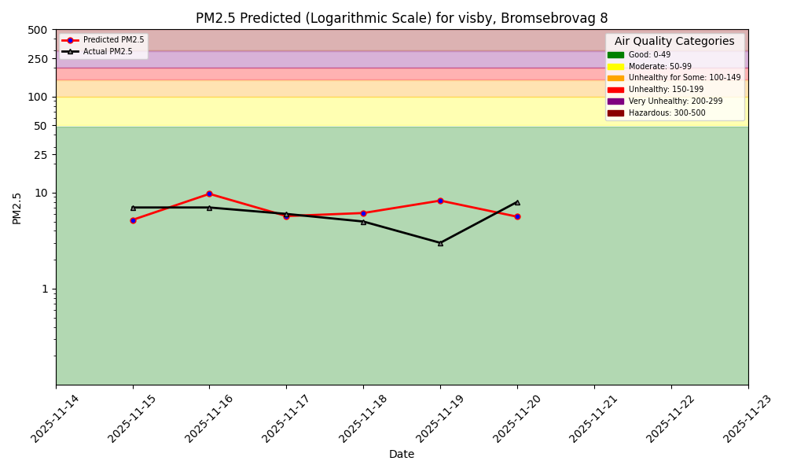
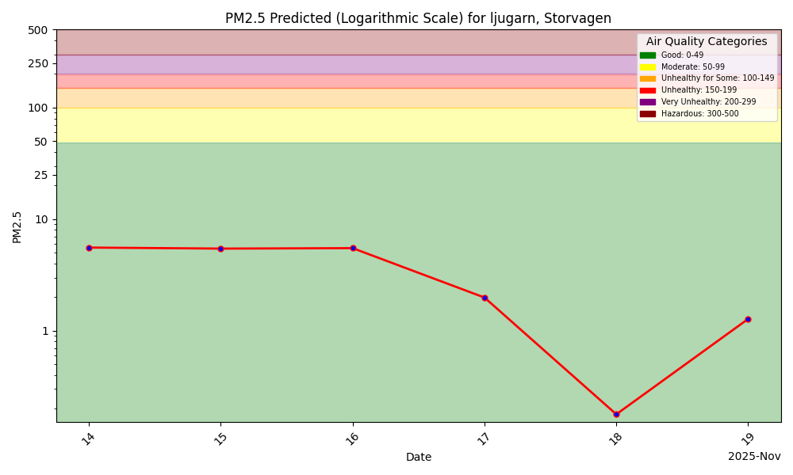
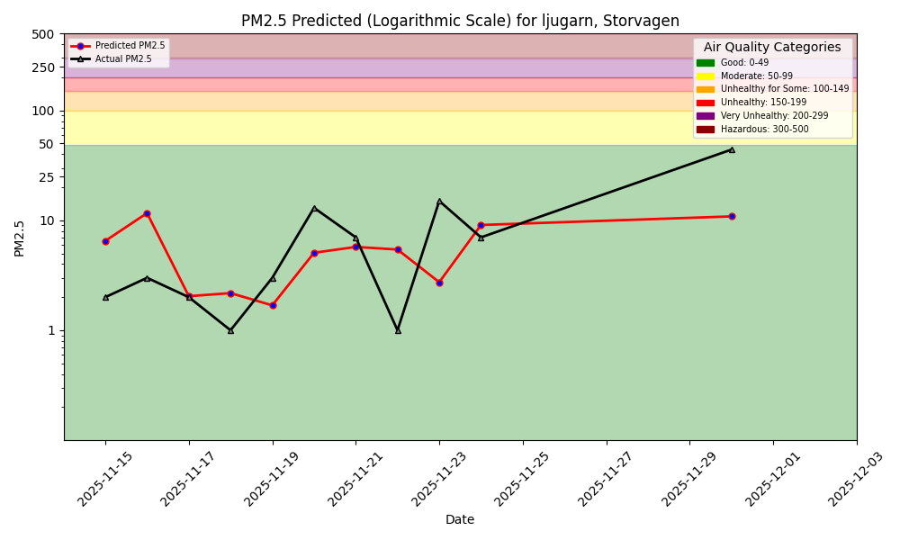
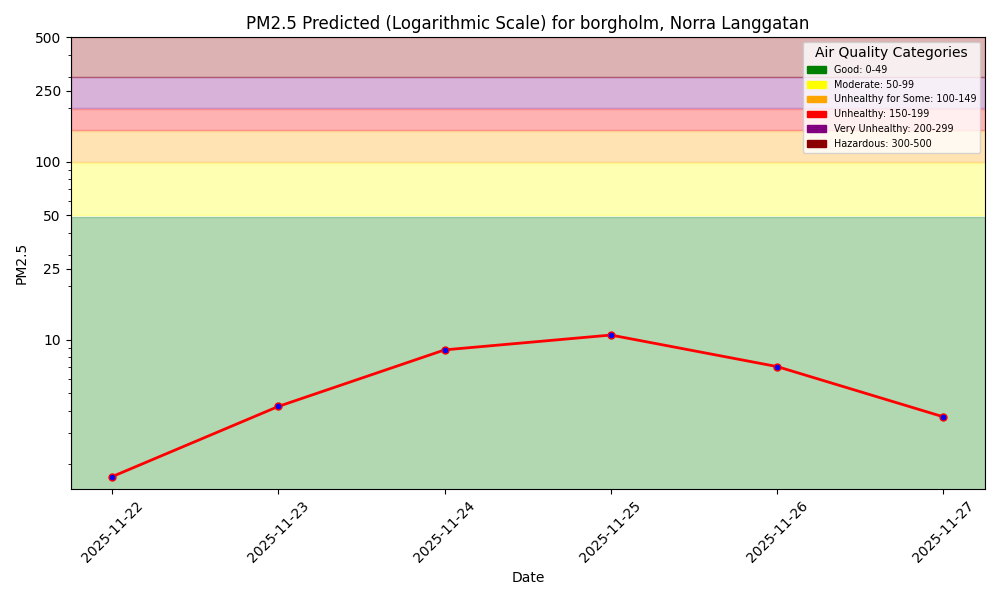

# Air Quality Dashboard

<link rel="stylesheet" href="./assets/css/air-quality.css">

  

    This page presents PM2.5 forecasts and hindcasts for five sensors located on Gotland and in Kalmar.
    The models predict air quality based on historical measurements and are updated daily.
  

  

    <h3>Gotland: Visby – Östra Tvärgatan</h3>
    
    
  

  

    <h3>Gotland: Visby – Österväg 17</h3>
    
    
  

  

    <h3>Gotland: Visby – Brömsebroväg 8</h3>
    
    
  

  

    <h3>Gotland: Ljugarn – Storvägen</h3>
    
    
  

    

    <h3>Kalmar: Öland – Norra Långgatan</h3>
    
    
    

    

        The sensor for Norra Långgatan, Borgholm (Kalmar County) has not been in use since
        <strong>2025-08-21</strong>. We have therefore only used data up to this date for training.
        The hindcast plot does not work for this station because no new daily outcome data is being published.
    

    

        <em>This air quality monitoring station has been automatically disabled due to abnormal data readings.</em> 
        For more information, check the data validation page for this sensor:
        <a href="https://aqicn.org/station/validation/@71104" target="_blank" rel="noopener">aqicn.org/station/validation/@71104</a>
    

    

  

