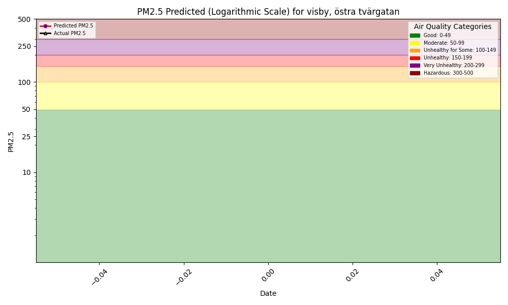

# Air Quality Dashboard



There is also a Python program to interact with the air quality ML system using language (text, voice),
powered by a [function-calling LLM](https://www.hopsworks.ai/dictionary/function-calling-with-llms).

# Model Performance Monitoring

1-Day Hindcast: Predictions vs Outcomes

